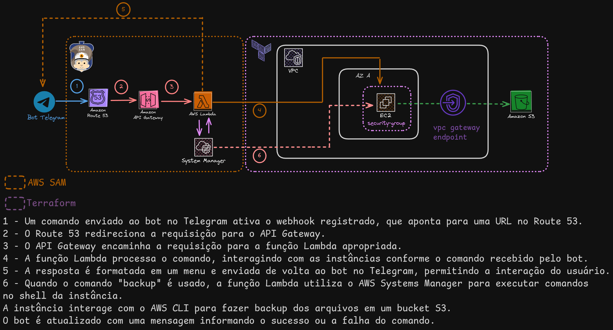

# Projeto: Servidor de Terraria na AWS com Terraform e AWS SAM

## Introdução
Este projeto tem como objetivo principal criar um servidor do jogo Terraria na AWS utilizando ferramentas como Terraform e AWS SAM. Além disso, visa integrar a infraestrutura da AWS com um bot interativo no Telegram para facilitar a interação e gerenciamento do servidor.

## Objetivos
- Criar e gerenciar um servidor Terraria na AWS.
- Utilizar Terraform para provisionar a infraestrutura.
- Implementar funcionalidades serverless com AWS SAM.
- Integrar a infraestrutura com um bot Telegram interativo.
## Fluxo da aplicação


### Video demonstrando o bot no telegram
https://github.com/user-attachments/assets/4f4982de-bf58-4802-82ed-f28a739929a8

OBS: o video foi editado para diminuir o tamanho do arquivo.

## Requisitos
- **AWS SAM**: [Documentação AWS SAM](https://docs.aws.amazon.com/serverless-application-model/latest/developerguide/what-is-sam.html)
- **Terraform**: [Documentação Terraform](https://www.terraform.io/docs/index.html)
- **Bot Telegram**: 
  - Criar um bot e obter o token: [Documentação Bot Telegram](https://core.telegram.org/bots#creating-a-new-bot)
- **AWS CLI**
  - Instalar e configurar o AWS CLI: [Documentação AWS CLI](https://docs.aws.amazon.com/cli/latest/userguide/cli-chap-getting-started.html)
  - usar o comando ```aws configure```
  - Insira as credenciais da AWS, a região padrão e o formato de saída quando solicitado.
## Configurações Necessárias
### Criar o arquivo `terraform.tfvars`
No diretório `infra`, crie o arquivo `terraform.tfvars` utilizando as variáveis de exemplo fornecidas no arquivo `terraform_example.tfvars`. As variáveis incluem:
- **Token do Bot Telegram**
- **IP com máscara de rede /32** (exemplo: `192.168.0.1/32`)
- **Caminho para a chave pública** (exemplo: `~/.ssh/public_key.pub`)

### Criar uma Chave SSH
Para criar uma chave SSH que será utilizada com a instância EC2:
```bash
ssh-keygen -t ed25519
```
## Deploy
### Provisionar a Infraestrutura
Para provisionar a infraestrutura, utilize o comando:
```bash
$ cd infra
$ terraform apply
```
Guarde os outputs, como o `BucketName` e o ARN da instância EC2, para serem utilizados no deploy do AWS SAM.

### Configurar o Servidor de Terraria
Acesse a instância EC2 via SSH e configure o servidor de Terraria seguindo as instruções:
[Terraria Server Configuration](https://terraria.fandom.com/wiki/Server#How_to_(Linux))

### Deploy da parte Serverless com AWS SAM
Utilize o comando abaixo para fazer o deploy das funcionalidades serverless:
```bash
$ cd serverless
$ sam deploy --guided
```
Durante o processo, forneça os parâmetros `BucketName` e o ARN da instância EC2 quando solicitado.

### Registrar o Webhook do Bot Telegram
Utilize o link do API Gateway, que é gerado como output do deploy, para registrar o webhook do bot no Telegram:
[Documentação sobre registro de webhook no Telegram](https://core.telegram.org/bots/api#setwebhook)

